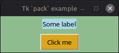

# Widgets

## Widget creation

### Top-level widgets

A top-level or a menu widget are created by:

```julia
top = TkToplevel(interp=TclInterp(), [path,] option => value, ...)
menu = TkMenu(interp=TclInterp(), [path,] option => value, ...)
```

where `interp` is the interpreter where to create the widget (the shared interpreter of the
thread by default), `path` is a string like `".top"` or `".menu"` (it must start with a dot
and have no other dots) and `option => value, ...` denotes any number of settings with
`option` an option name (a string or a symbol without a leading hyphen) and `value` the
option value. The `path` argument is optional; if omitted, a widget path is automatically
generated in the form `".$(pfx)$(num)"` where `pfx` is a short prefix specific to the widget
class and `num` is a unique number.

The widget path (given by `w.path` for a widget `w`) is also the name of the Tcl command
implementing the widget behavior and is used for any reference to the widget.

For example:

```julia-repl
julia> top = TkToplevel(:relief => :sunken, :borderwidth => 5, :background => :cyan)
TkToplevel(".top3")

```

Symbols like `:relief` and `:sunken` can also be specified as literal strings (or
as Tcl objects but this is less common): `:relief => :sunken`, `"relief" => "sunken"`, or
`:relief => "sunken"` are all the same.


### Other widgets

Non-top level widgets have a parent (a top-level widget, a frame, etc.) which must be
provided to the constructor. For example, a label is created by something like:

```julia
lab = TkLabel(parent, [child,] option => value, ...)
```

where `child` is the path of the widget relative to its parent, it must have no dots. The
relative path, `child`, is optional and is automatically generated if omitted.

The path of the widget is the concatenation of its parent path and the widget relative path
with a dot separator. The widget path is given by the property `w.path` for a widget `w`.
The widget path is unique for a given interpreter, if a widget constructor is called with a
path of an existing widget, a Julia object wrapping the same Tk widget is returned. However,
the constructor must correspond to the class of the existing widget. To relax this, a widget
instance can be built for an existing widget by calling the abstract constructor `TkWidget`:

```julia
w = TkWidget(interp=TclInterp(), path)
w = TkWidget(interp=TclInterp(), parent, child)
```

The latter case is equivalent to have `path = "$(parent).$(child)"` in the former case.


## Widget sub-commands

Tk widgets may be invoked to execute sub-commands (the list of which depend on the widget
type). There are different two equivalent ways to call a widget sub-command:

```julia
TclTk.exec(T=TclObj, widget, subcmd, args...)
widget(T=TclObj, subcmd, args...)
```

where `widget` is a widget instance, optional leading argument `T` is the expected type of
the result (a Tcl object by default), `subcmd` is the sub-command name (a string, a symbol,
or a Tcl object) and `args...` are the arguments of the sub-command. For example, assuming
`btn` is a button widget, retrieving the associated text can be done by one of:

```julia
TclTk.exec(String, btn, :cget, "-text")
btn(String, :cget, "-text")
```

!!! warning
    Another possibility could be to evaluate a Tcl script as in:

    ```julia
    TclTk.eval(String, "$btn cget -text")
    ```

    However, this is not recommended as `TclTk.eval` in this example will use the shared
    interpreter of the thread whereas the interpreter which may not be the one where
    lives the widget. This is avoided by the other ways to execute a sub-command.


## Geometry managers

Non-top level widgets must be managed by a *geometry manager* to become visible. Tk provides
3 different geometry managers to organize widgets within a so-called *container* widget
(their parent by default):

* The *placer* geometry manager, via the [`TclTk.place`](@ref) function, provides simple
  fixed placement of widgets inside their container.

* The *packer* geometry manager, via the [`TclTk.pack`](@ref) function, packs the widgets
  in order against the edges of their container.

* The *grid* geometry manager, via the [`TclTk.grid`](@ref) function, arranges widgets in
  rows and columns inside their container.

These geometry managers take a variable number of arguments, one of which must be a widget
and all widget arguments must live in the same interpreter.

For example packing a label and a button one above the other in a top-level window can be
done by:

```julia
interp = tk_start()
top = TkToplevel(interp, :background => "darkseagreen")
lab = TkLabel(top, :text => "Some label", :background => "lightblue")
btn = TkButton(top, :text => "Click me", :background => "goldenrod", :command => "puts {Hello world!}")
TclTk.pack(Nothing, btn, lab, :side => :bottom, :padx => 90, :pady => 5)
interp(Nothing, :wm, :title, top, "Tk `pack` example")
```

which gives:



## Widget configuration

### Configuration at creation

For the following examples, we create a top-level window `top` with embedded label `lab` and
button `btn` widgets as follows:

```julia
using TclTk
tk_start()
top = TkToplevel()
lab = TkLabel(top, :text => "Some label", :background => "lightblue")
btn = TkButton(top, :text => "Please push me...", :command => "puts {Button pushed!}")
TclTk.pack(Nothing, btn, :side => :top, :padx => 70, :pady => 5)
```

This shows how `option => value` pairs can be used at widget creation to set some
configurable options.

### The `cget` sub-command

Configuration options of `btn` can be queried by the `cget` sub-command as in the following
examples:

```julia-repl
julia> TclTk.exec(btn, :cget, "-text") # each argument is a token
TclObj("Please push me...")

julia> btn(:cget, "-text") # shortcut for the above example
TclObj("Please push me...")

julia> TclTk.cget(btn, :text) # option name without hyphen
TclObj("Please push me...")

julia> btn[:text] # option name without hyphen
TclObj("Please push me...")

```

As can be seen, any of these statements yields a Tcl object whose content is the value of
the `-text` option. Which syntax is preferred is a matter of taste.

An optional Julia type may be specified to convert the value of the Tcl object:

```julia-repl
julia> TclTk.exec(String, btn, :cget, "-text") # each argument is a token
"Please push me..."

julia> btn(String, :cget, "-text") # shortcut for the above example
"Please push me..."

julia> TclTk.cget(String, btn, :text) # option name without hyphen
"Please push me..."

julia> btn[String, :text]
"Please push me..."

julia> btn[:text, String]
"Please push me..."

julia> btn[:text => String]
"Please push me..."

```

Specifying a Julia type for the expected result is a bit faster than converting the result
to this type as with:

```julia-repl
julia> String(btn[:text])
"Please push me..."

```

### The `configure` sub-command

For an existing widget, re-configuration can be done by via the `configure` sub-command
(often abbreviated to `config`) of the widget:

```julia-repl
julia> TclTk.exec(btn, :config, :background => "darkseagreen")
TclObj("")

```

or equivalently:

```julia-repl
julia> btn(:config, :background => "darkseagreen")
TclObj("")

```

Any number of option settings can be specified for `configure` sub-command but since
configuring one or more options yields an empty result, `Nothing` may be specified as the
expected result type:

```julia-repl
julia> btn(Nothing, :config, :foreground => "firebrick", :background => "darkseagreen")

```

As a shortcut, changing a single option can also be done by the `setindex!` method:

```julia-repl
julia> btn[:background] = "darkseagreen"
"darkseagreen"

```

Without any `option => value` pairs, the `configure` sub-command yields a list of all current settings:

```julia-repl
julia> btn(:config)
TclObj((("-activebackground", "activeBackground", "Foreground", "#ececec", "#ececec",), ("-activeforeground", "activeForeground", "Background", "#000000", "#000000",), ("-anchor", "anchor", "Anchor", "center", "center",), ("-background", "background", "Background", "#d9d9d9", "darkseagreen",), ("-bd", "-borderwidth",), ("-bg", "-background",), ("-bitmap", "bitmap", "Bitmap", "", "",), ("-borderwidth", "borderWidth", "BorderWidth", 1, 1,), ("-command", "command", "Command", "", "puts {Button pushed!}",), ("-compound", "compound", "Compound", "none", "none",), ("-cursor", "cursor", "Cursor", "", "",), ("-default", "default", "Default", "disabled", "disabled",), ("-disabledforeground", "disabledForeground", "DisabledForeground", "#a3a3a3", "#a3a3a3",), ("-fg", "-foreground",), ("-font", "font", "Font", "TkDefaultFont", "TkDefaultFont",), ("-foreground", "foreground", "Foreground", "#000000", "firebrick",), ("-height", "height", "Height", 0, 0,), ("-highlightbackground", "highlightBackground", "HighlightBackground", "#d9d9d9", "#d9d9d9",), ("-highlightcolor", "highlightColor", "HighlightColor", "#000000", "#000000",), ("-highlightthickness", "highlightThickness", "HighlightThickness", 1, 1,), ("-image", "image", "Image", "", "",), ("-justify", "justify", "Justify", "center", "center",), ("-overrelief", "overRelief", "OverRelief", "", "",), ("-padx", "padX", "Pad", "3m", "3m",), ("-pady", "padY", "Pad", "1m", "1m",), ("-relief", "relief", "Relief", "raised", "raised",), ("-repeatdelay", "repeatDelay", "RepeatDelay", 0, 0,), ("-repeatinterval", "repeatInterval", "RepeatInterval", 0, 0,), ("-state", "state", "State", "normal", "normal",), ("-takefocus", "takeFocus", "TakeFocus", "", "",), ("-text", "text", "Text", "", "Please push me...",), ("-textvariable", "textVariable", "Variable", "", "",), ("-underline", "underline", "Underline", "", "",), ("-width", "width", "Width", 0, 0,), ("-wraplength", "wrapLength", "WrapLength", 0, 0,),))

```
